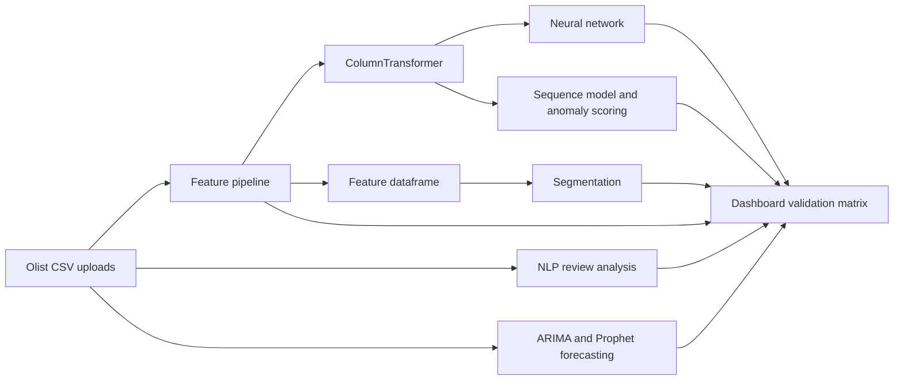

# Enterprise AI Platform - technical documentation

## Purpose

This repository contains one Streamlit application (`app.py`) that connects Olist retail data ingestion, feature engineering, machine learning, NLP, segmentation, sequence analysis, and forecasting in a single workflow. Each module consumes the prepared dataset held in Streamlit session state; there are no detached application entrypoints.

## System flow

## Module design and evidence

| Rubric area | Implementation | Primary evidence in the application |
|---|---|---|
| Customer conversion | Perceptron and configurable MLP; ReLU, sigmoid, tanh; SGD, Adam, RMSProp; early stopping and class weights | Accuracy, classification report, confusion matrix, loss and accuracy plots |
| Sentiment and feedback | Tokenization, stopword filtering, stemming, lemmatization, POS, sentiment, NER, TF-IDF, Word2Vec, GloVe comparison | Sentiment and token charts, entity/POS tables, embedding comparison |
| Risk and mitigation | LSTM and GRU, Dropout, BatchNorm, L1/L2 controls, Isolation Forest | MSE/RMSE/MAE, prediction/history plots, anomaly scores and chart |
| Strategic partitions | K-Means, DBSCAN, Agglomerative, PCA, t-SNE, UMAP | Cluster metrics, summaries, latency logs, selectable reductions |
| Transformation pipes | Lag features, target encoding, SMOTE, class weights, ColumnTransformer | Pipeline report and before/after diagnostics |
| Financial demand horizons | ARIMA and Prophet with decomposition, rolling statistics and ACF | Forecast comparison, agreement diagnostic, validation RMSE/MAE/MAPE |

## Running the application

1. Install the pinned dependencies with `pip install -r requirements.txt`.
2. Install the spaCy English model with `python -m spacy download en_core_web_sm`.
3. Start the dashboard with `streamlit run app.py`.
4. Upload all seven Olist files on **Data upload** and select **Prepare Enterprise Dataset**.
5. Use each analytical module from the left navigation. Model outputs are produced only after the user selects **Train**, **Run**, or **Compare**.
6. Return to **Dashboard** and download the **Validation performance matrix**. It collects numeric validation signals from the modules run during the current session.

## Data and model safeguards

- Neural networks require a true binary target with enough examples of both classes for stratified validation.
- Sequence models validate the target, feature shape, row count, and sequence length before TensorFlow training.
- Segmentation uses numeric fields, median imputation, and standard scaling before clustering.
- Forecasting aggregates the selected numeric measure by the selected frequency. Empty activity periods are treated as zero rather than being forward-filled. ARIMA and Prophet are compared at the same timestamps.
- The application reports expected data limitations as Streamlit messages instead of exposing raw model tracebacks.

## Validation and interpretation

The validation matrix is a record of executed runs, not a cross-model leaderboard: accuracy, clustering metrics, regression errors, and NLP document counts have different meanings. Use it as submission evidence that each module executed and produced its own appropriate validation signal.

For forecasting, ARIMA and Prophet may legitimately produce different values because they fit different model families. Use the holdout validation table and the normalized agreement diagnostic, not visual similarity alone, to judge the forecasts.

## Submission checklist

- [ ] Upload the seven required Olist datasets and verify preprocessing completes.
- [ ] Run each major module at least once with suitable data.
- [ ] Download the dashboard validation matrix into `analytical_reports/`.
- [ ] Capture dashboard screenshots and save them under `analytical_reports/`.
- [ ] Prepare the required 8-10 slide technical summary and live walkthrough video.
- [ ] Remove `.venv`, `env`, `__pycache__`, `.pyc`, temporary files, and local datasets before creating the ZIP.
- [ ] Submit one compressed project ZIP with this README, this document, source code, and evidence files.
